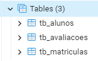

# Desafio DIO Academia Digital by Marton Lyra
#ContratoDeCompromissoDIO

#dio-desafio-academia-digital

## O Projeto Spring Data JPA - API RESTful

Olá! Meu nome é Marton e nesse repositório vou manter o progresso de desenvolvimento do desafio **Academia Digital**, do Bootcamp **Banco PAN Java Developer** da plataforma [DIO](https://www.dio.me/).

Os detalhes do desafio podem ser acessados diretamente da plataforma DIO [clicando aqui](https://web.dio.me/project/conhecendo-spring-data-jpa-na-pratica-com-java/learning/abd511f0-a5be-4f02-a204-03eb2614a12a).

A instrutora é a [Camila Cavalcante](https://www.linkedin.com/in/cami-la/) e seu repositório GitHub pode ser acessado através [desse link](https://github.com/cami-la/academia-digital). 

Optei por não fazer um fork de seu projeto pois preferi criar o meu do zero.

## Objetivo:

Nesse desafio vamos desenvolver uma **API RESTful** no domínio de uma academia de ginástica usando banco de dados PostgreSQL e mapeamento objeto-relacional (ORM) usando Spring Data JPA.

Vamos usar as seguintes Tecnologias:

- **IntelliJ IDEA**: IDE que escolhi para desenvolver;
- **Java 17**: apesar do projeto original ter sido desenvolvido em Java 11, tenho em minha máquina instalado o Java 17. Vou tentar desenvolver pelo Java 17. Se encontrar grandes dificuldades, volto para o Java 11.
- **Spring Data JPA**: para realizar o mapeamento objeto-relacional (ORM);
- **Spring Web**: para rodar o servidor web e escutar nossas chamadas API através do Apache Tomcat;
- **PostgreSQL 15.2-2**: o banco de dados escolhido para persistir nossos dados;
- **Hibernate Validator**: um validador de Bean com Hibernate;
- **Lombok**: uma biblioteca para reduzir códigos repetitivos mas necessários através de Java Annotation.
- **Postman**: ferramenta para realizar requisições web afim de testarmos nosso serviço;

## Progresso:

Vou reportar o meu progresso nesse projeto, incluindo as dificuldades que tive e como resolvi.

## 13/04/2023:

- Comecei criando um projeto usando o **Spring Initializr**. As configurações iniciais do projeto podem ser [acessadas aqui](https://start.spring.io/#!type=maven-project&language=java&platformVersion=3.0.5&packaging=jar&jvmVersion=17&groupId=me.dio&artifactId=desafio-academia-digital&name=desafio-academia-digital&description=Desafio%20DIO%20-%20Academia%20Digital%20by%20MartonJr&packageName=me.dio.desafio-academia-digital&dependencies=web,data-jpa,postgresql,validation,lombok). 
- No GitHub, criei o repositório onde irei guardar o [presente projeto](https://github.com/MartonLyra/dio-desafio-academia-digital).
- Certifiquei-me de que minha assinatura digital está devidamente configurado e que todos meus commits serão assinados por mim.
- Em seguida, instalei o PostgreSQL localmente em minha máquina.

## 14/04/2023:

- Resolvi detalhar nesse _readme.md_ o progresso do meu desenvolvimento.

---

- Comecei o dia [pesquisando](https://projectlombok.org/videos/lombok.mp4) sobre a biblioteca **Lombok** pois não a conhecia:

Pelo que entendi, você introduz algumas tags na classe do model e os _getters, setters, toString, hashCode_, dentre outros, são gerados pela biblioteca via _Reflection_, sem necessidade de gerar e manter tais códigos. Gostei pois manteve o visual da classe do model mais limpo.

---

- Durante o desenvolvimento, vamos ficar de olho no Diagrama ER BD:

---

- O **fluxo back-end** será: Cliente <---> Controller <---> Service <---> Repository <---> PostgreSQL.

- Criei as classes model [Aluno](src/main/java/me/dio/desafioacademiadigital/model/Aluno.java), [AvaliacaoFisica](src/main/java/me/dio/desafioacademiadigital/model/AvaliacaoFisica.java) e [Matricula](src/main/java/me/dio/desafioacademiadigital/model/Matricula.java); 

- Criei as classes DTO (Data Transfer Object): [AlunoDTO](src/main/java/me/dio/desafioacademiadigital/model/dto/AlunoDTO.java), [AlunoUpdateDTO](src/main/java/me/dio/desafioacademiadigital/model/dto/AlunoUpdateDTO.java), [AvaliacaoFisicaDTO](src/main/java/me/dio/desafioacademiadigital/model/dto/AvaliacaoFisicaDTO.java), [AvaliacaoFisicaUpdateDTO](src/main/java/me/dio/desafioacademiadigital/model/dto/AvaliacaoFisicaUpdateDTO.java), [MatriculaDTO](src/main/java/me/dio/desafioacademiadigital/model/dto/MatriculaDTO.java).
  - A instrutora Camila optou por colocar essas classes dentro do package 'entity/form' e usou o sufixo 'Form' na nomenclatura das classes.
  - Eu optei por colocá-los na package 'model/dto' e usar o sufixo 'DTO' no nome das classes.

- Criei as interfaces de serviço: [IAlunoService](src/main/java/me/dio/desafioacademiadigital/service/IAlunoService.java), [IMatriculaService](src/main/java/me/dio/desafioacademiadigital/service/IMatriculaService.java), [IAvaliacaoFisicaService](src/main/java/me/dio/desafioacademiadigital/service/IAvaliacaoFisicaService.java).

### Video-Aula: Configuração do Banco de Dados

- Configurei o banco **PostgreSQL** no arquivo **application.yml** com os dados de conexão local: spring.datasource: url; jdbc; username; password.

- Configurei **Spring Data JPA** no arquivo **application.yml**: show-sql:true (queremos que o SQL gerado pelo ORM seja exibido no console); hibernate.ddl-auto: update (quando a aplicação é iniciada, o hibernate deve procurar alterações na estrutura de dados entre banco de dados e objetos relacionais e gerar os DDL e atualizar o banco de dados de forma que fique compatível com nosso entity).

- Lá na aula '**Video-Aula: CRUD - Parte 1**' será adicionado mais uma propriedade para formatar o SQL.

- *org.postgresql.util.PSQLException: FATAL: database "academia" does not exist* - usando o *pgAdmin*, criei o banco de dados chamado *academia* e a aplicação rodou sem Exception.

### Video-Aula: Anotações das Entidades - Parte 1

- Logo no início da aula, a instrutora Camila faz uso da [biblioteca Lombok](https://projectlombok.org/). Como essa biblioteca é novidade pra mim, resolvi criar um [teste unitário](src/test/java/me/dio/desafioacademiadigital/model/AlunoTest.java) da classe [Aluno](src/main/java/me/dio/desafioacademiadigital/model/Aluno.java) para vê-lo funcionando na prática. Para testar, faço chamadas dos getters, setters, hashcode e toString, sendo que nenhum desses métodos foram implementados manualmente na classe.

- Alterei as classes model [Aluno](src/main/java/me/dio/desafioacademiadigital/model/Aluno.java), [AvaliacaoFisica](src/main/java/me/dio/desafioacademiadigital/model/AvaliacaoFisica.java) e [Matricula](src/main/java/me/dio/desafioacademiadigital/model/Matricula.java) para colocar as annotações, tanto do **Lombok** quanto do **Spring Data JPA**.

### Video-Aula: Anotações das Entidades - Parte 2

- Ao executar a aplicação, as tabelas foram geradas conforme experado:

- Tomei conhecimento da ferramenta de gerenciamento GUI de banco de dados chamado [DBeaver](https://dbeaver.io/) compatível com diversos bancos de dados.

### Video-Aula: CRUD - Parte 1

- Antes de começarmos a aula de CRUD, uma observação no arquivo application.yml: foi adicionado uma configuração para que o Hibernate formate o SQL gerado que será exibido no console: properties.hibernate.format_sql: true

- Vamos precisar converter alguns dos parâmetros web no formato data de String para LocalDate e LocalDateTime. Para isso, implementei a classe [DateTimeUtils](src/main/java/me/dio/desafioacademiadigital/infra/DateTimeUtils.java) com dois métodos: **convertStringToLocalDate(String date)** e **convertStringToLocalDateTime(String datetime)**. Aproveitei e implementei também a classe [DateTimeUtilsTest](src/test/java/me/dio/desafioacademiadigital/infra/DateTimeUtilsTest.java) e percebi que os métodos podem melhorar: ele converte o String "07/05/2015" mas não converte o String "7/5/2015".

- Criei a package '**controller**' onde vamos tratar as requisições API Rest, repassar apenas as informações relevantes aos services e, após processamento, responder à requisição.
- Criei a package '**service**' onde vamos escrever as regras de negócio e controlar o acesso aos dados.
- Criei a package '**repository**' responsável pelo acesso ao banco de dados onde, no nosso caso, são interfaces que extendem de JpaRepository.

- Implementei [AlunoController](src/main/java/me/dio/desafioacademiadigital/controller/AlunoController.java), [IAlunoService](src/main/java/me/dio/desafioacademiadigital/service/IAlunoService.java), [AlunoServiceImpl](src/main/java/me/dio/desafioacademiadigital/service/impl/AlunoServiceImpl.java) e [AlunoRepository](src/main/java/me/dio/desafioacademiadigital/repository/AlunoRepository.java) com o método getAll(LocalDate dataNascimento), cujo parâmetro dataNascimento é opcional. Agora a aplicação responde às seguintes requisições:
  - GET   http://localhost:8080/alunos
  - GET   http://localhost:8080/alunos?dtNascimento=13/11/1978

- Implementei e testei **Aluno.create()** nas classes especificadas acima:

  - POST  http://localhost:8080/alunos/create
    -  {
          "nome": "MartonLyra",
          "cpf": "12345678901",
          "bairro": "Meu Bairro",
          "dtNascimento": "1978-11-13"
       }

## 15/04/2023:

### Video-Aula: CRUD - Parte 2

- Instrutora Camila deu a dica do [plug-in do Chrome JSON Formatter](https://chrome.google.com/webstore/detail/json-formatter-viewer-and/infnlhnhibphpaljmnnadaldibggkokb), que formata, no browser, objetos JSON´s para melhor visualização. Como estou fazendo as requisições via Postman, não instalei.

- Sempre que vamos fazer acesso ao banco de dados com JPA, normalmente criamos uma interface que extende de public interface JpaRepository<>. Porém, nessa vídeo-aula a instrutora mostrou outra opção: extender a interface de CrudRepository. O JpaRepository<> extende de CrudRepository, portanto, o JpaRepository<> possui mais métodos e mais opções.

- Implementamos, em todas as camadas, o método AvalizacaoFisica.create(). Agora nossa aplicação também responde a:
  - POST   http://localhost:8080/avaliacoes/create
    - Na requisição: 
      {
          "alunoId": 1,
          "peso": 64.7,
          "altura": 171.5
      }
    - Obtivemos a resposta:
      {
          "id": 1,
          "aluno": {
              "id": 1,
              "nome": "Marton",
              "cpf": "1122334455",
              "bairro": "Meu Bairro",
              "dtNascimento": "1978-11-13"
          },
          "dataDaAvaliacao": "2023-04-15T15:22:11.4870003",
          "peso": 64.7,
          "altura": 171.5
      }

---
_Base64:_ RGVzYWZpbyBESU8gIkFjYWRlbWlhIERpZ2l0YWwiLCBieSBNYXJ0b25MeXJhLCBpbmljaWFkbyBkaWEgMTMvMDQvMjAyMy4=
